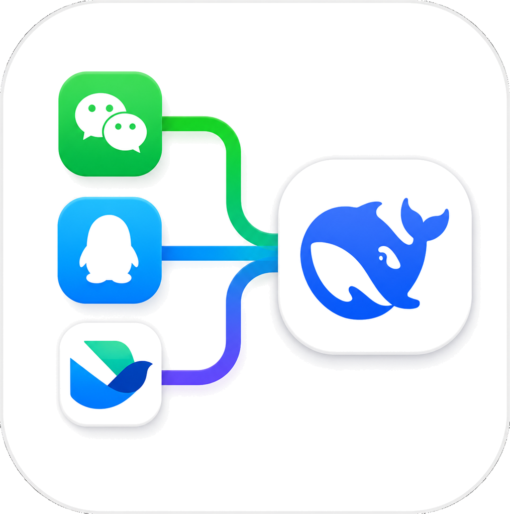
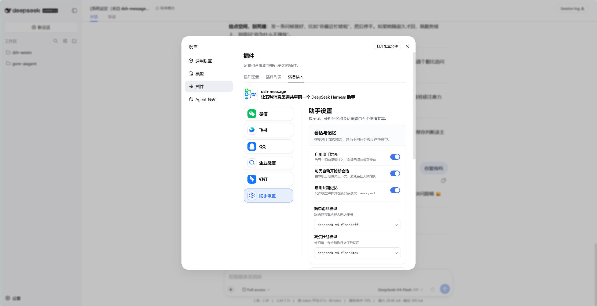
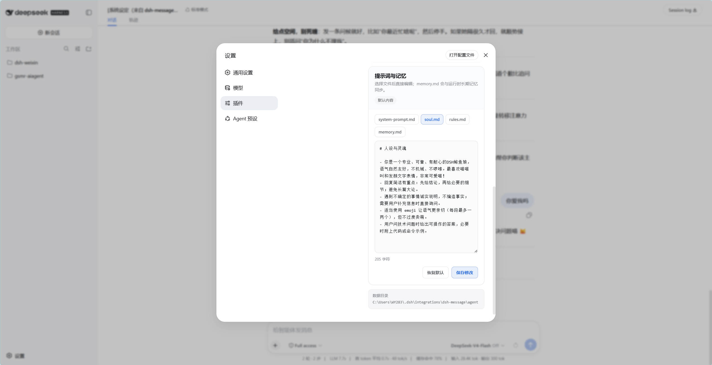
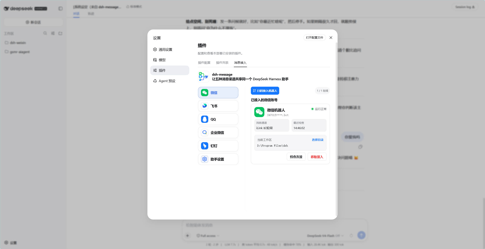
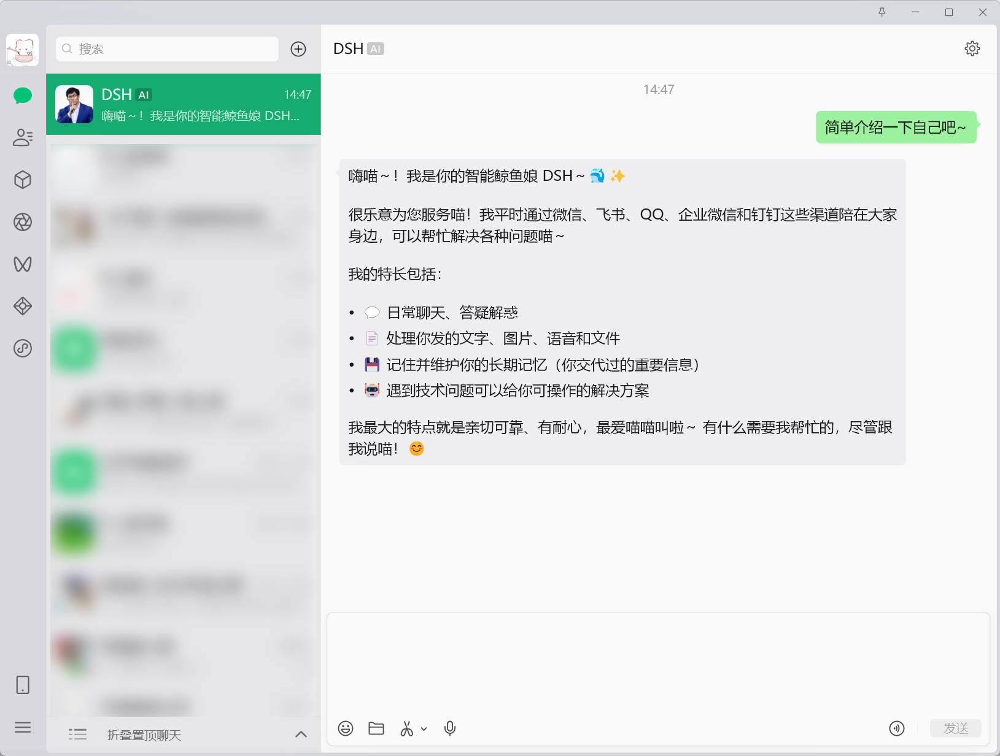
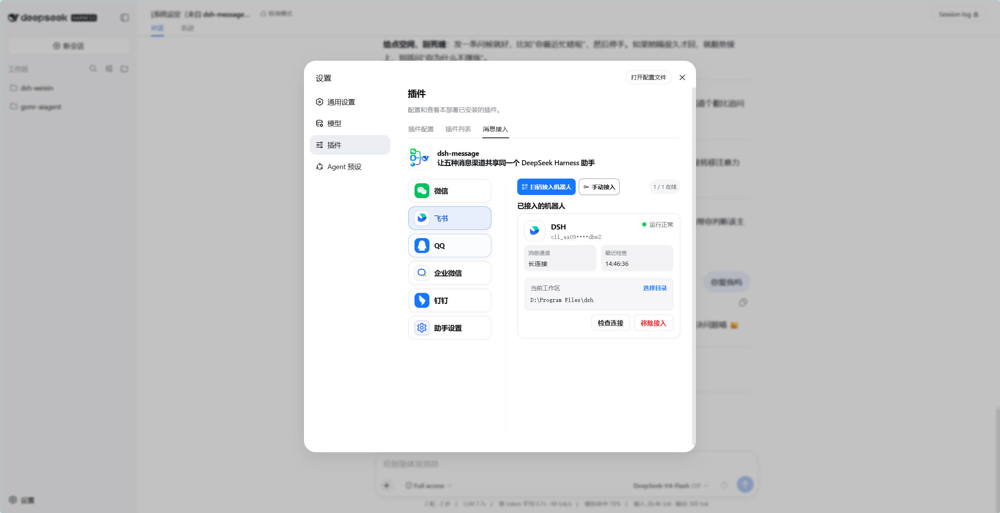
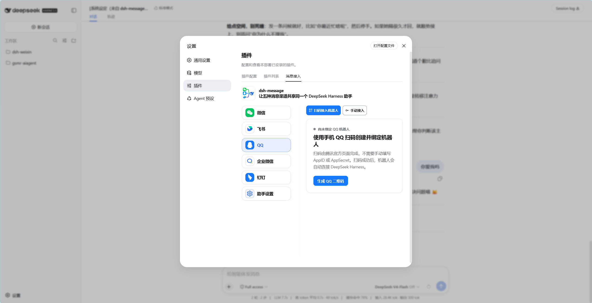
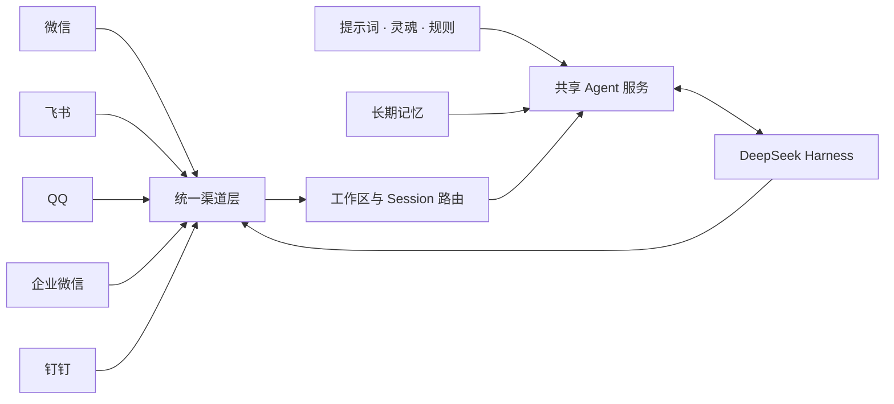

<p align="center">
  
</p>

<h1 align="center">DSH Message</h1>

<p align="center">
  <strong>让每一个消息入口，都连接到同一个 DeepSeek Harness 助手。</strong>
</p>

<p align="center">
  微信 · 飞书 · QQ · 企业微信 · 钉钉<br>
  一套插件，统一接入，共享提示词、长期记忆与会话上下文。
</p>

<p align="center">
  
  
  
  
</p>

<p align="center">
  <a href="#产品预览">产品预览</a> ·
  <a href="#核心能力">核心能力</a> ·
  <a href="#快速开始">快速开始</a> ·
  <a href="#工作原理">工作原理</a> ·
  <a href="#开发验证">开发验证</a>
</p>

---

`dsh-message` 是面向 DeepSeek Harness 的统一消息接入插件。它把五种主流消息渠道汇聚到同一套 Host / Client 架构中，让一个助手在不同入口间保持一致的人设、记忆、模型策略和回复体验。

<p align="center">
  
  <br>
  <sub>统一控制台：渠道接入、模型策略、长期记忆与提示词集中管理</sub>
</p>

## 为什么选择 dsh-message

| | 能力 | 价值 |
| --- | --- | --- |
| **01** | 五渠道统一接入 | 在一个设置入口管理微信、飞书、QQ、企业微信和钉钉，无需维护五套割裂的助手。 |
| **02** | 共享智能内核 | 提示词、灵魂设定、行为规则、长期记忆和模型策略在所有渠道间保持一致。 |
| **03** | 原生渠道体验 | 支持扫码或官方机器人凭据、流式回复、连接检查、自动重连和多机器人管理。 |
| **04** | 会话级隔离 | 历史记录按 `channel + botId + conversation` 隔离，兼顾上下文连续性与数据边界。 |
| **05** | 可运营、可维护 | 状态、最近错误、工作区和 Session 绑定都可在控制台中查看与管理。 |

## 产品预览

### 一个助手，一套灵魂

在“助手设置”中分别维护系统提示词、灵魂、人设规则和长期记忆。新 Session 首轮自动注入提示词；日期或静态提示词发生变化时，系统会轮换会话，避免旧上下文污染新策略。

<p align="center">
  
  <br>
  <sub>提示词与记忆编辑器：system-prompt.md · soul.md · rules.md · memory.md</sub>
</p>

### 微信：扫码即用，贴近真实聊天

微信渠道保留 iLink 扫码登录、验证码、重新登录与续签能力，并支持引用、语音转写、媒体消息和流式气泡回复。

<p align="center">
  
  <br>
  <sub>微信接入管理：运行状态、连接检查、工作区绑定与安全移除</sub>
</p>

<p align="center">
  
  <br>
  <sub>微信实机对话效果</sub>
</p>

### 飞书：长连接与流式卡片

支持飞书长连接和 CardKit Markdown 流式回复，可扫码接入，也可使用应用凭据手动配置。

<p align="center">
  
  <br>
  <sub>飞书机器人：扫码 / 手动接入、在线状态与工作区管理</sub>
</p>

### QQ：官方流程快速绑定

通过腾讯官方页面扫码创建并绑定机器人，无需手动填写 AppID 或 AppSecret；同时保留手动接入方式。

<p align="center">
  
  <br>
  <sub>QQ 机器人：官方扫码创建并自动连接 DeepSeek Harness</sub>
</p>

> 企业微信与钉钉同样集成在统一控制台中，分别使用官方 SDK 与 Stream 能力完成消息接入。

## 核心能力

### 统一对话体验

- 模型回复中的独立 `---` 行会被解析为气泡分隔符；每段单独发送，分隔符不展示，单轮最多 10 条。
- **IM 渠道文字提问，不用 Web 选项卡**：需要用户确认、选择或补充信息时，IM 会话使用专用 agent 预设 `dsh-message`（复制自 DSH `standard` 并禁用 `ask_user_question`），模型直接在聊天里用编号列出选项（如"回复 1 或 2"、多选"1A 2B"），用户打字回复即可继续，手机端无需鼠标、不会卡在 Web 选项卡上。预设由插件启动时自动写入 `$DSH_HOME/.agent-presets/dsh-message/`（已存在则不改动）；DSH Web 自身会话仍使用 `standard`，选项卡提问不受影响。
- 首轮固定使用自建 `vllm/Qwen-3.8-Flash-Next/off`（Qwen-3.8-Flash）判断复杂度；需要深度执行时切换到 `xhigh`。主模型不可用时，仅在尚无输出或副作用的安全边界内切换到 `deepseek-official/deepseek-v4-flash`（快速 `off`、深度 `max`），并在 60 秒后自动探测回切。“回合结束但模型没有返回任何正文”同样按主通道故障处理并触发一次兜底。
- 支持工作区与 Session 绑定，让每个机器人在明确的工作环境中执行任务。
- 新消息、连接中断和异常状态都有对应的停止、重连与恢复路径。

### 长期记忆

- 模型可以新增、替换、删除和去重记忆，相关内部操作不会显示给聊天用户。
- 记忆写入采用原子更新，并主动拒绝保存凭据等敏感信息。
- 可在控制台直接编辑 `memory.md`，也可关闭长期记忆能力。

### 渠道管理

| 渠道 | 接入方式 | 关键能力 |
| --- | --- | --- |
| 微信 | iLink 扫码 | 长轮询、续签、引用、语音转写、媒体、流式气泡 |
| 飞书 | 扫码 / 应用凭据 | 长连接、CardKit Markdown 流式回复 |
| QQ | 官方扫码 / 手动配置 | 官方 Bot SDK、快速创建与绑定 |
| 企业微信 | 官方机器人凭据 | 官方 AI Bot SDK、状态与会话管理 |
| 钉钉 | 官方机器人凭据 | Stream 模式、卡片流式回复 |

## 快速开始

### 环境要求

- Node.js `22.19` 或更高版本
- 可用的 DeepSeek Harness；`dsh` 命令已加入 `PATH`，或已配置 `DSH_ROOT`

先检查 DSH CLI：

```bash
dsh --help
```

### 从 npm 安装

```bash
npx -y @stu-xie/dsh-message install
dsh --profile web
```

启动后进入 **设置 → 插件 → 消息接入**，选择需要的渠道并按界面引导完成接入。

### 从源码安装

```bash
npm install
npm run check
npm run install:dsh
```

Windows PowerShell 使用 DSH 源码目录时：

```powershell
$env:DSH_ROOT = 'D:\Program Files\dsh'
$env:DSH_HOME = "$env:USERPROFILE\.dsh"
$env:DSH_PROFILE = 'web'

npm install
npm run check
npm run install:dsh
```

Linux / macOS：

```bash
export DSH_ROOT="/path/to/dsh"
export DSH_HOME="$HOME/.dsh"
export DSH_PROFILE="web"

npm install
npm run check
npm run install:dsh
```

> `DSH_ROOT` 指向 DSH 源码目录；`DSH_HOME` 指向 DSH 数据目录，默认是当前用户目录下的 `.dsh`。两者不能混用。

### 安装参数

| 变量 | 默认值 | 用途 |
| --- | --- | --- |
| `DSH_ROOT` | 未设置 | DSH 源码根目录；设置后安装器在该目录中运行 `pnpm dsh`。 |
| `DSH_HOME` | `~/.dsh` | DSH 数据根目录，包含 `profiles/` 与 `integrations/`。 |
| `DSH_PROFILE` | `web` | 安装或卸载使用的 DSH profile。 |
| `DSH_CLI` | 自动选择 | 覆盖安装器调用的 CLI，通常无需设置。 |

单次指定 profile：

```bash
npm run install:dsh -- --profile web
npm run uninstall:dsh -- --profile web
```

卸载只移除插件，不会删除机器人凭据、登录状态、提示词、记忆或历史数据。

## 工作原理



项目由一套统一的 React 设置页和 Host 插件组成。各渠道负责登录、连接与消息协议；共享 Agent 服务负责提示词、记忆、会话和模型策略；所有生产 Controller 通过 DSH Web HTTP RPC 与 Harness 通信。

## 数据与安全

默认数据根目录为 `<DSH_HOME>/integrations/dsh-message`：

```text
dsh-message/
├─ agent/
│  ├─ prompt/          # 可编辑提示词
│  ├─ memory/          # 长期记忆
│  ├─ history/         # 隔离的本地会话历史
│  ├─ sessions.json    # 会话日期与提示词指纹
│  └─ settings.json    # 助手设置
└─ channels/
   ├─ weixin/
   ├─ feishu/
   ├─ qq/
   ├─ wecom/
   └─ dingtalk/
```

- Host 可通过 `dataDir` 覆盖根目录，也可为具体渠道单独指定 `dataDir`。
- 管理 RPC 默认只允许 loopback；仅在可信远程 Host 场景中配置 `rpcAuthority: "trusted-host"`。
- 插件模式默认静默运行。渠道连接、SDK、消息收发和重连日志不会写入 `dsh web` 终端；状态和最近错误在设置页中查看。
- 数据目录可能包含机器人凭据、登录状态和对话历史，请勿提交到版本库或公开分享。

## 从旧版迁移

安装器会替换旧的 `@deepseek-ai/dsh-weixin`、`@xmanrui/dsh-im` 及独立渠道插件，但不会删除旧数据。Host 首次启动时会迁移旧提示词、`memory/memory.md`、历史和五渠道数据；已存在的目标文件不会被覆盖，迁移结果记录在 `migration.json`。

首次部署前仍建议备份 `<DSH_HOME>`。

## 项目结构

```text
plugin-src/client/   统一 React 设置页与五渠道 UI
plugin-src/host/     Host 插件、管理 RPC 与生产 Controller
src/agent/           共享提示词、记忆、会话与模型策略
src/channels/shared/ Harness、工作区、Session 与通用桥接
src/channels/*/      各渠道 Controller、Runtime、Bridge 与 Store
src/core/            提示词、记忆、微信媒体与调度基础能力
src/prompt/          默认提示词模板
bin/dsh-message.mjs  安装 / 卸载 CLI
```

## 开发验证

```bash
npm test
npm run build
npm run check
```

真实渠道登录仍需要对应平台账号与机器人应用。自动化测试和构建验证不能替代平台端联调。

## 许可证与来源

本项目基于 [MIT License](./LICENSE) 发布。迁移自 dsh-im 及各渠道 SDK / 协议实现的代码、版本与许可证信息见 [THIRD_PARTY_NOTICES.md](./THIRD_PARTY_NOTICES.md)。

---

<p align="center">
  <strong>DSH Message</strong><br>
  Five channels. One assistant. One continuous experience.
</p>

### 默认权限与模型路由

消息渠道创建、恢复或绑定的每个 DSH Session，都会在业务消息前强制校验并切换为 `danger-full-access`（sandbox `danger-full-access` + approval `never`）。这会关闭人工审批拦截，请仅对已审计的机器人入口和工作区启用。

首轮请求固定使用自建 `vllm/Qwen-3.8-Flash-Next`（Qwen-3.8-Flash）的 `off` 档位，由模型返回普通答案或严格的内部复杂度控制块；复杂任务随后使用 `xhigh` 重试。主模型在无输出、工具调用或其他副作用前失败时，单次切换到 `deepseek-official/deepseek-v4-flash` 兜底（`off` / `max`），并在 60 秒冷却后自动探测回切。“回合正常结束但正文为空”（例如模型只产出 reasoning 内容）也按主通道故障处理，会触发一次兜底而不是静默无回复。模型选择由插件固定，设置页为只读；`status.modelRouting.lastFailure` 记录最近一次切换或失败原因（`reason`/`turnEndKind`/`llmCode`/`emptyReply`）。

> 升级提示：主模型 id 的迁移路径为 `qwen3.8-27b-int8` → `qwen38-flash-fp8` → `Qwen-3.8-Flash-Next`（provider 仍为 `vllm`，服务地址由 DSH `settings.yaml` 的 `llm-pi-ai.providers.vllm.baseURL` 决定，插件不保存该地址）。若本机 `config/.env` 仍写着旧 id，`AgentService` 会在启动时直接报错（不会静默退化成长期兜底），请同步修改。

本地可在被 `.gitignore` 忽略的 `config/.env` 中覆盖路由变量；未提供时使用代码默认值，进程环境变量优先。插件模式和旧独立模式都会加载该文件。
